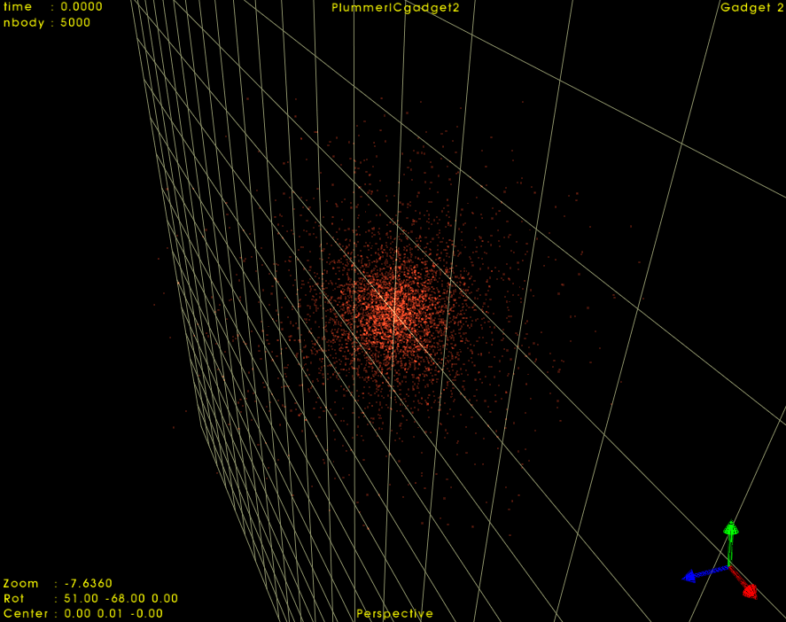

# About
The Plummer Model may be useful to represent stellar systems such as globular clusters, dwarf galaxies, or to serve as a toy model in N-body simulations containing these types of simple spherical distribution of particles.
This python script generates initial conditions in the usual Gadget system of units (check the parameters file) for a Plummer Sphere. There are three possible output formats: txt, GADGET-2 binary, HDF5.

# Required python packages
- os  
- sys
- struct
- numpy
- ConfigParser

# Usage
Simply edit the parameters in the `plummer_params.ini` file as you desire, then run `ic.py`

    python ic.py

The directory `InitialConditions` will be create with the output file within it.

# Comments
1. The [`snapwrite.py`](https://github.com/elvismello/clustep/blob/master/clustep/snapwrite.py) module is exactly the same as in [Elvis Mello's](https://github.com/elvismello) adaptation for python 3 of [Rafael Ruggiero's](https://github.com/ruggiero) clustep, necessary in order to write the output in the gadget2 binary format or hdf5.
2. In the gadget2 format, all particles are set to the particle type 'stars'. You can change this by editing [this line of code](https://github.com/n-ssouza/plummerIC/blob/main/ic.py#L151) accordingly.
3. The overall structure of `ic.py` is basically the same as [clustep's](https://github.com/elvismello/clustep). Therefore I plan on creating a more general software which would be able to generate initial conditions for many different profiles (for instance, implementing King's model into the code should be an easy task).

# Example

